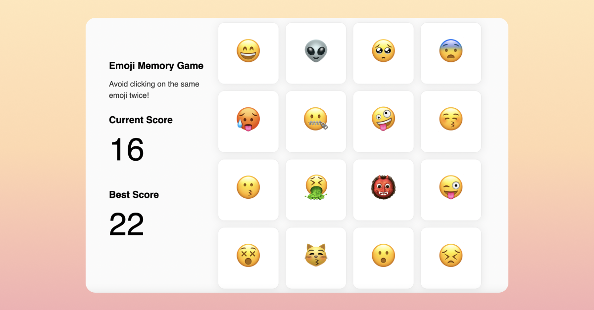

# TOP Javascript Course Project - Memory Game



[Play Emoji Memory Game](https://emhng.github.io/odin-memorygame/)

## Playing locally

If you'd like to play locally

1. Download the repo by clicking on Code -> Download Zip
2. Unzip the file and open the folder using your IDE of choice (i.e. VsCode)
3. Run the following command

```
npm install
```

4. Run the following command to start the game

```
npm start
```

## Project Objectives

Using react.js - functional components and hooks, create a memory game where players must avoid clicking on the same card twice.

Your game should include the following:

- Display the current score and the player's best score
- Randomize the cards each time

## Learnings

Getting a better feel for how to code inside of React.
